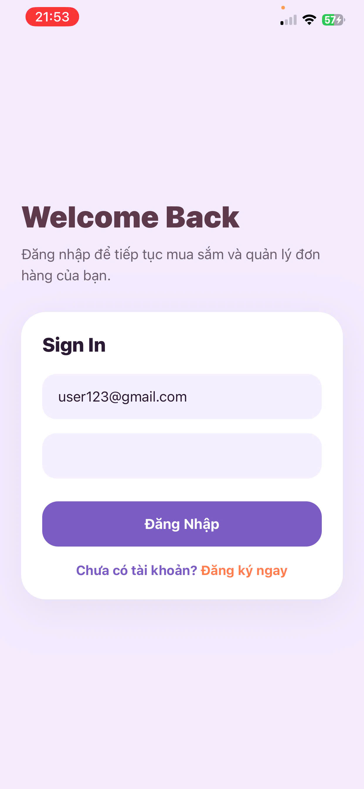
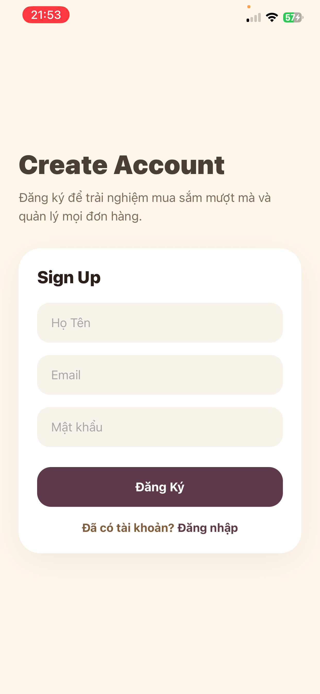
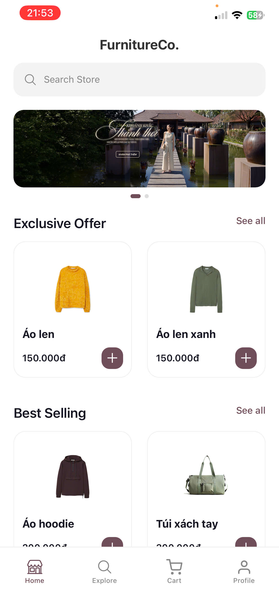
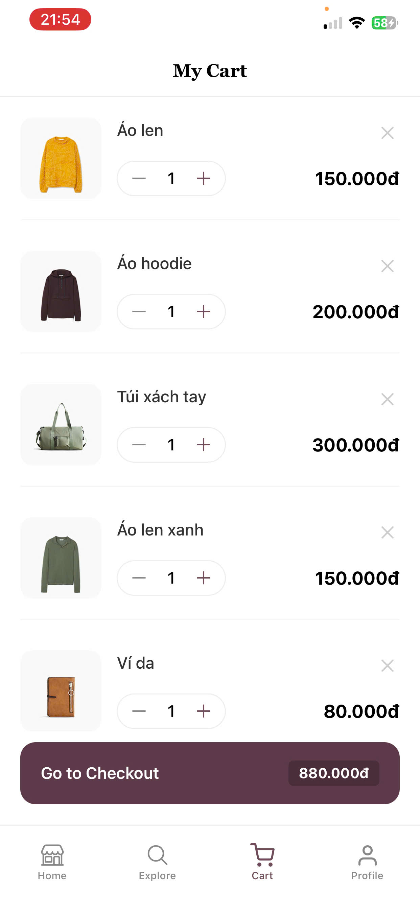
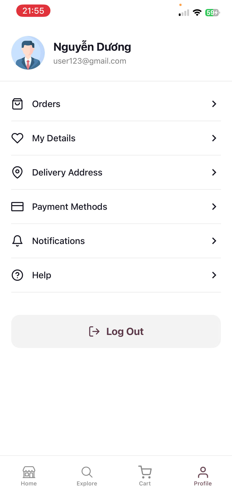

Tên đề tài : Xây dựng ứng dụng bán quần áo

Giới thiệu đề tài : 
Mục tiêu tổng quát của đề tài là xây dựng một ứng dụng bán quần áo trực tuyến hoạt động trên nền tảng web, cung cấp đầy đủ các chức năng cần thiết cho cả người dùng và quản trị viên.
Các mục tiêu cụ thể bao gồm:
•	Nghiên cứu và áp dụng các công nghệ phát triển web hiện đại vào việc xây dựng hệ thống 
•	Thiết kế giao diện người dùng thân thiện, dễ sử dụng và phù hợp với nhiều đối tượng 
•	Xây dựng chức năng đăng ký, đăng nhập và quản lý thông tin người dùng 
•	Phát triển hệ thống hiển thị sản phẩm với các chức năng tìm kiếm, lọc và phân loại 
•	Xây dựng chức năng giỏ hàng, cho phép người dùng thêm, sửa, xóa sản phẩm trước khi đặt hàng 
•	Triển khai chức năng đặt hàng và quản lý đơn hàng 
•	Xây dựng hệ thống quản trị cho phép quản lý sản phẩm, danh mục, đơn hàng và khách hàng 
•	Đảm bảo tính bảo mật thông tin và hiệu suất hoạt động của hệ thống 
Thông qua việc thực hiện đề tài, nhóm cũng hướng tới việc nâng cao kỹ năng làm việc nhóm, kỹ năng lập trình, phân tích hệ thống và giải quyết vấn đề trong thực tế.

Danh sách thành viên : 
1. Nguyễn Quốc Chí - MSV : 23810310390 - Nhiệm vụ : Làm Layout đăng nhập, Layout đăng kí, Layout trang chủ, Trang chủ ứng dụng, Màn hình đăng nhập, Màn hình đăng ký, báo cáo chương 1
2. Nguyễn Đại Dương - MSV : 23810310319 - Nhiệm vụ : Làm Layout tìm kiếm, Layout giỏ hàng, Layout trang cá nhân, Màn hình tìm kiếm, Màn hình giỏ hàng, Màn hình thanh toán, báo cáo chương 2
3. Nguyễn Văn Trung - MSV : 23810310321 - Nhiệm vụ : Làm Màn hình Splash Screen, Màn hình Onboarding, Thông báo kết quả đơn hàng, Màn hình tài khoản, Màn hình lịch sử mua hàng, Màn hình chi tiết đơn hàng, báo cáo chương 3

Công nghệ sử dụng : 
• React Native — xây dựng giao diện ứng dụng mobile đa nền tảng Android/iOS.
• Expo — hỗ trợ chạy và build ứng dụng nhanh mà không cần cấu hình Android Studio/Xcode quá nhiều.
• React Navigation — điều hướng giữa các màn hình trong ứng dụng. Bao gồm: Stack Navigation và Bottom Tab Navigation
• AsyncStorage — lưu dữ liệu cục bộ trên thiết bị như đăng nhập, giỏ hàng,…
• React Native Paper — thư viện hỗ trợ thiết kế giao diện Material Design.
• Expo Image Picker — hỗ trợ chọn ảnh từ thư viện hoặc camera.
• Expo Vector Icons — sử dụng icon cho giao diện ứng dụng.

Hướng dẫn cài đặt: 
Yêu cầu môi trường
Cần cài đặt trước:
Node.js
Visual Studio Code
Expo Go trên điện thoại Android/iOS
Các bước cài đặt
Bước 1: Clone source code
git clone <link-github>
Hoặc tải source code về máy và giải nén.
Bước 2: Mở project bằng VS Code
cd ten-project
code .
Bước 3: Cài đặt thư viện
Mở Terminal và chạy:
npm install
Lệnh này sẽ cài đặt toàn bộ dependencies trong file package.json.

Hướng dẫn chạy project: Chạy ứng dụng bằng Expo
Trong Terminal, chạy:
npm start
Hoặc:
expo start
Script này đã được khai báo trong package.json.
Sau khi chạy sẽ xuất hiện mã QR của Expo.
Chạy trên điện thoại
Cài ứng dụng Expo Go trên điện thoại.
Kết nối điện thoại và máy tính cùng mạng WiFi.
Mở Expo Go và quét mã QR để chạy ứng dụng.

Hình ảnh minh họa hệ thống: 
Trang đăng nhập: 
Trang đăng ký: 
Trang chủ: 
Giỏ hàng: 
Thông tin tài khoản: 

Tài khoản demo : 
Tài khoản : user1@gmail.com
Mật khẩu : duong1

Link video demo : https://drive.google.com/file/d/1rtGj7fYh37vrMEpwi5nwduiNX4CID9d4/preview

